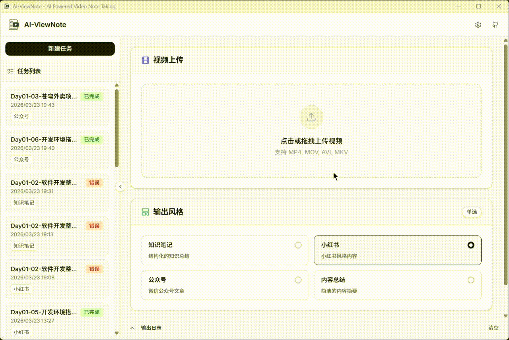
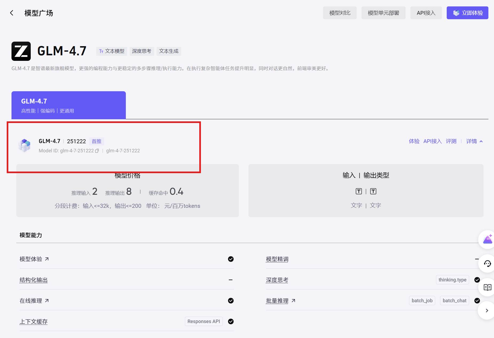
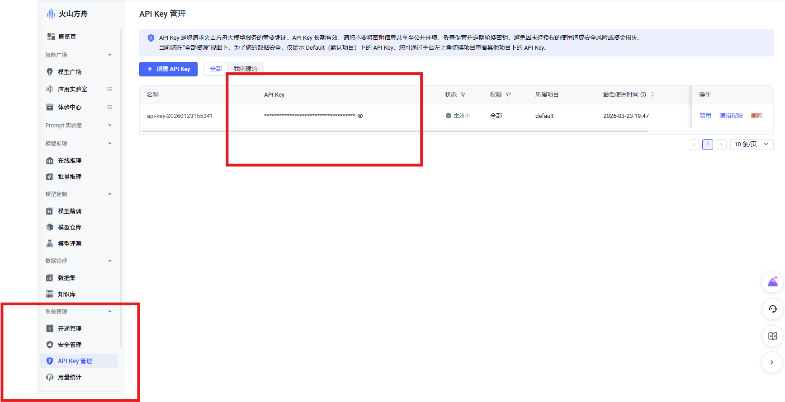
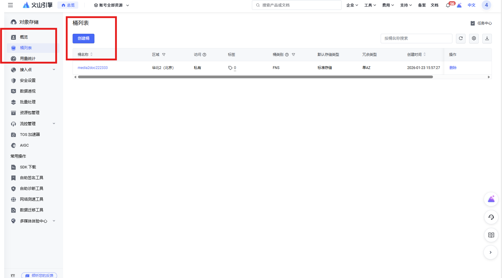
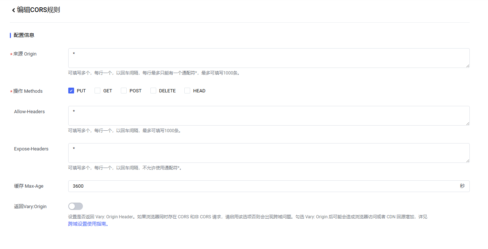
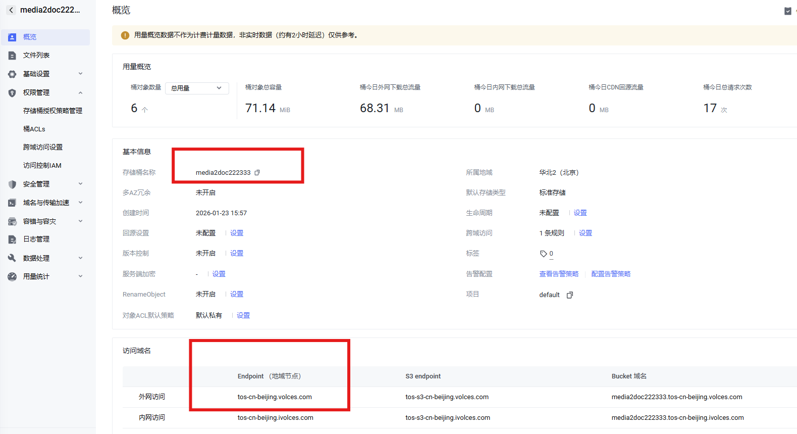
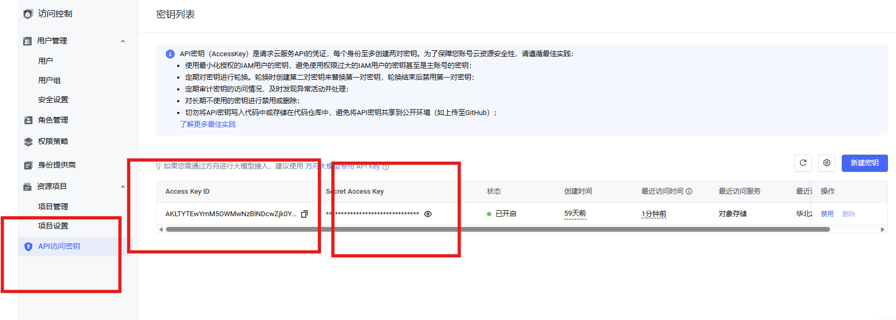
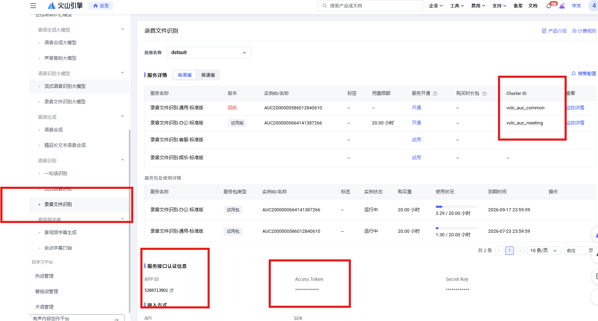

<h1 align="center">
  <p>
    
  </p>
  <p>AI-ViewNote</p>
</h1>

<p align="center">
  🤖 AI-powered video note-taking application that transforms audio and video content into structured text notes.
</p>

<p align="center">
  <a href="./LICENSE"></a>
  
  
  
</p>

AI-ViewNote 是一款基于 Wails v3 构建的现代化桌面应用程序，集成了本地音视频处理、云端语音识别（ASR）以及大语言模型（LLM）能力，帮助用户将视频或音频内容智能转化为结构化的文字笔记。🎯 支持多种笔记风格，满足不同场景的学习和记录需求。

## 🎥 项目预览



## ✨ 功能特性

- 🎬 **本地音视频处理**：集成 FFmpeg，支持音视频格式快速转换与音频提取，确保高效的媒体文件处理能力
- 🎤 **语音转写提取**：结合火山引擎等云服务，实现高精度语音到文本（Speech-to-Text）转换，准确率可达95%以上
- 🧠 **AI 智能笔记生成**：通过标准 OpenAI 接口（支持多种大模型），对转写文本进行智能分析，生成多种风格的笔记：
  - 📚 **知识笔记**：结构化的知识总结，包含时间标记，便于复习和查阅
  - 💄 **小红书风格**：亲切有趣的内容风格，善用 Emoji 和标签，适合社交平台分享
  - 📱 **公众号风格**：专业的微信公众号文章格式，逻辑清晰、观点鲜明
  - 📝 **内容总结**：简明扼要的摘要，突出核心观点和关键信息
- 🎨 **现代化桌面 UI**：前端采用 React + TypeScript + Vite + Tailwind CSS / Radix UI 构建，提供流畅美观的本地用户体验

## ⚙️ 配置指南

在使用 AI-ViewNote 之前，需要配置相关服务的 API 密钥以启用完整功能。

### 🤖 LLM 服务配置

AI-ViewNote 兼容任何支持 OpenAI 接口的大模型服务。以下以火山方舟大模型为例进行配置说明：

1. [登录方舟控制台](https://console.volcengine.com/ark)，点击开通管理，开通相关模型

2. 选择开通一个大模型，开通后点击进入详情页查看模型 ID

    

3. 点击 API Key 管理创建新的 API Key

   

4. 火山方舟大模型的 OpenAI 接口地址为：
   ```
   https://ark.cn-beijing.volces.com/api/v3
   ```

### ☁️ TOS 服务配置

对象存储服务用于文件上传和管理。目前支持火山引擎 TOS，未来将引入更多服务提供商。

1. 打开[对象存储服务控制台](https://console.volcengine.com/tos)，点击桶列表并创建新桶

   

2. 创建完成后进入该存储桶，点击右侧权限管理，找到跨域访问设置并新建规则

   

3. 在此页面可以找到 bucketName 和 Endpoint

   

4. Region 设置：如果地域节点是北京，则 Region 填写 `cn-beijing`，其他地域同理

5. 进入 [IAM 控制台](https://console.volcengine.com/iam/keymanage)，新建密钥获取 Access Key 和 Secret Key

   


### 🎯 ASR 服务配置

语音识别服务用于将音频内容转换为文本。目前支持火山引擎语音识别服务，未来将引入更多服务提供商。

1. 打开[音频大模型控制台](https://console.volcengine.com/speech/app)
2. 点击语音识别中的**录音文件识别**（注意：不是**录音文件识别大模型**）
3. 创建应用后即可获得 AUC_APP_ID、AUC_ACCESS_TOKEN 和 AUC_CLUSTER_ID

   


## 🙏 致谢

特别感谢以下开源项目：

- [Wails v3](https://github.com/wailsapp/wails) - 为本项目提供现代化的桌面应用开发框架
- [AI-Media2Doc](https://github.com/hanshuaikang/AI-Media2Doc) - 为本项目提供思路

## 📄 开源协议

本项目基于 [MIT License](LICENSE) 协议发布，欢迎个人和商业使用。🎉
