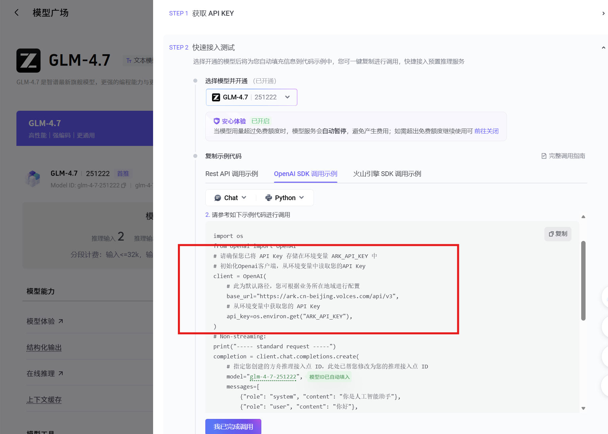

# AI-ViewNote

AI powered video note taking application.

AI-ViewNote 是一款基于 Wails v3 构建的现代化桌面应用程序。它集成了本地音视频处理、云端语音识别（ASR）以及大语言模型（LLM）能力，能够帮助用户一键将视频或音频内容转化为结构化的文字笔记和各种风格笔记。

## 项目预览


##  功能特性

-  **本地音视频处理**：集成了 FFmpeg，支持音视频格式的快速转换与音频提取。
-  **语音转写提取**：结合火山引擎（Volcengine）等云服务，实现高精度的语音到文本（Speech-to-Text）转换。
-  **AI 智能笔记**：通过标准的 OpenAI 接口（支持多种大模型），快速对转写文本进行深加工，生成核心摘要、结构化大纲和总结笔记。
-  **现代化桌面 UI**：前端采用 React + TypeScript + Vite + Tailwind CSS / Radix UI 构建，提供流畅美观的本地用户体验。

##  配置指南

该应用程序需要自己设置服务API

### LLM 服务

兼容任何OpenAI接口的大模型。这里以火山方舟大模型为例。

[登录方舟控制台](https://console.volcengine.com/ark)，点击开通管理：


选择开通一个大模型，开通之后点击该大模型进入详情页，然后可以看到模型ID：


然后点击API Key管理创建一个API Key：


火山方舟的大模型 OpenAI 的接口地址可在文档中找到：



直接填入即可：
```
https://ark.cn-beijing.volces.com/api/v3
```

### tos 服务

对象存储服务，目前只支持火山引擎的调用，未来将引入更多服务的支持。

打开[对象存储服务控制台](https://console.volcengine.com/tos)，点击桶列表，然后创建一个桶：


创建完毕之后进入该 bucket。点击右侧权限管理, 找到跨域访问设置, 新建一条跨域访问规则。


bucktName和Endpoint都可以在这个页面找到：


如果地域节点是北京，Region就是北京，其他同理。

然后进入[IAM控制台](https://console.volcengine.com/iam/keymanage),新建一个密钥，就可以得到Access Key和Secret Key


### ASR 服务

实时语音识别服务，目前只支持火山引擎的调用，未来将引入更多服务的支持。

打开[音频大模型控制台](https://console.volcengine.com/speech/app)，点击语音识别中的**录音文件识别**，注意不是**录音文件识别大模型**，创建一个应用, 就得到了 AUC_APP_ID 和 AUC_ACCESS_TOKEN 和 AUC_CLUSTER_ID 的值：


##  开源协议

本项目基于 [MIT License](LICENSE) 协议发布。
